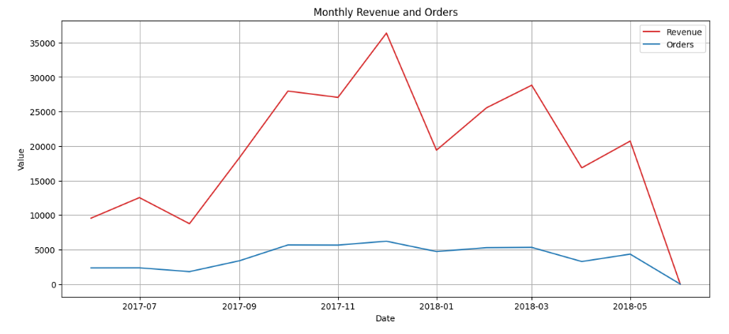
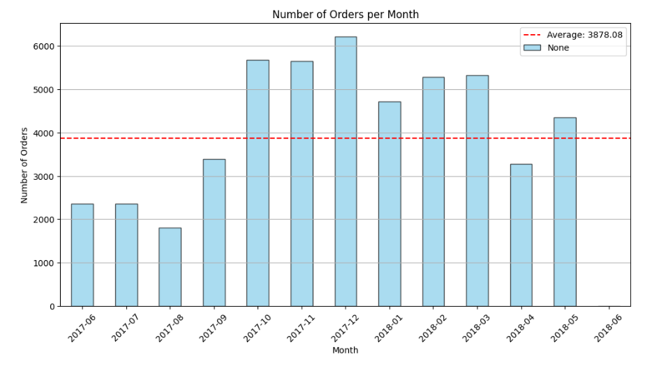
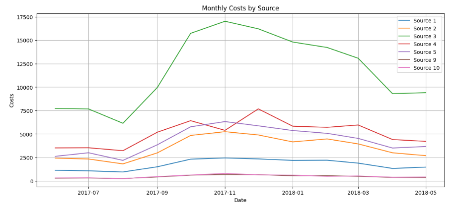

# Yandex.Music

## Overview
- Find the best selling moment for our subscription based yandex music platform.

## What is the reason for the project
- Yandex.music is trying to find the best moment to advertise their subscription during the year.
- They are trying to figure out the playtform that is more profitable for them.
- The type of ad that brings more revenue so increase the amount spent on this ad for the upcoming year.
- The amount of active users daily, weekly and monthly in case a maintenance is required in the future.

## Images

### Conclusion
- The month with the most number of orders is Novemeber and December with nearly 12k orders within both months.
- Source 3 is the source that costs to most for it to advertise.
- The monthly revenue start to increase around September until January, there for these are the best moment to advertise.

### Technologies
* This code was almost 100% build using Jupyter notebook. Through anaconda and Visual Studio as the platform to edit the code.
